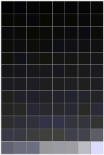
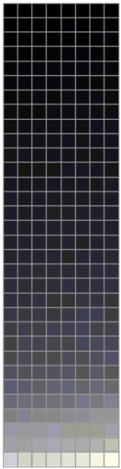
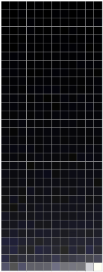
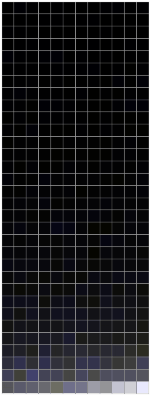
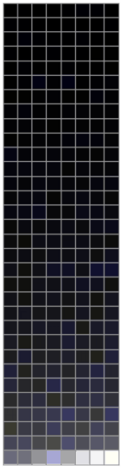
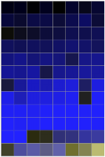
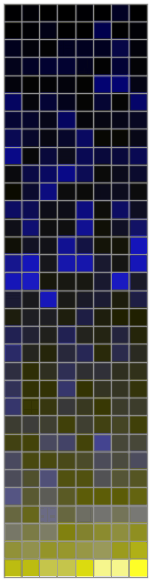
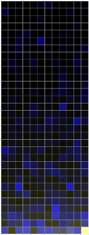
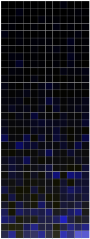
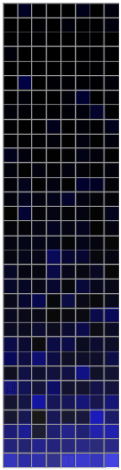

# FeatureSharing
Repository of materials to reproduce the results in the article "Visual pathways from the perspective of cost functions and multi-task deep neural networks".
Link to paper on bioRxiv: [http://biorxiv.org/content/early/2017/06/06/146472](http://biorxiv.org/content/early/2017/06/06/146472)

## Visualizations
Below are the representation-to-task-contributions over training time. 

Related Tasks

| conv1 | conv2 | conv3 | conv4 | conv5 |
| ---- | ---- | ---- | ---- | ---- |
|  |  |  |  |  |

Unrelated Tasks

| conv1 | conv2 | conv3 | conv4 | conv5 |
| ---- | ---- | ---- | ---- | ---- |
|  |  |  |  |  |

## Prerequisites
The following python packages are required to use this package:
- numpy (>= 1.11.1)
- matplotlib
- tqdm (for progress bars)
- [pytorch](https://github.com/pytorch/pytorch#installation)
- [nnadapter](https://github.com/mlosch/nnadapter#installation) (No Caffe or torch7 installation required)

## Reproducing results
To reproduce the visualizations in section 3 of the article, follow these steps:
- Clone or download this project 
`git clone https://github.com/mlosch/FeatureSharing.git && cd FeatureSharing`
- Download pretrained models and images via 
`bash scripts/download_pretrained_models.sh`
- Run marginalization of parameters. Depending on your system this may take days. You can alter the number of samples in the script to a small value to speed up the process in exchange for accuracy. 
`bash scripts/generate_conditionals.sh`
- Calculate the weighted evidence from the generated data 
`bash scripts/analysis_featurecontribution.sh`
- Render visualizations. They are saved in `data/processed/` 
`bash scripts/visualize_featurecontribution.sh`

## Generating data and training models
The full training data (and pretrained models) can be downloaded here:
- [Full training dataset](https://s3.eu-central-1.amazonaws.com/multitaskcnns/mtldataset_full.tar.gz)
- [Pretrained models](https://s3.eu-central-1.amazonaws.com/multitaskcnns/models.tar.bz2)

We used the [fb.resnet.torch](https://github.com/facebook/fb.resnet.torch) package in conjunction with [Torch7](http://torch.ch/docs/getting-started.html) to train our models.

The images have been overlayed with labels via the script `apply_random_label.py` in the `scripts` directory.
Given for example the imagenet dataset this script does the job with the following parameters: 
`python scripts/apply_random_label.py -d path/to/imagenet -l data/labels/label_list.txt -o path/to/outputfolder`
